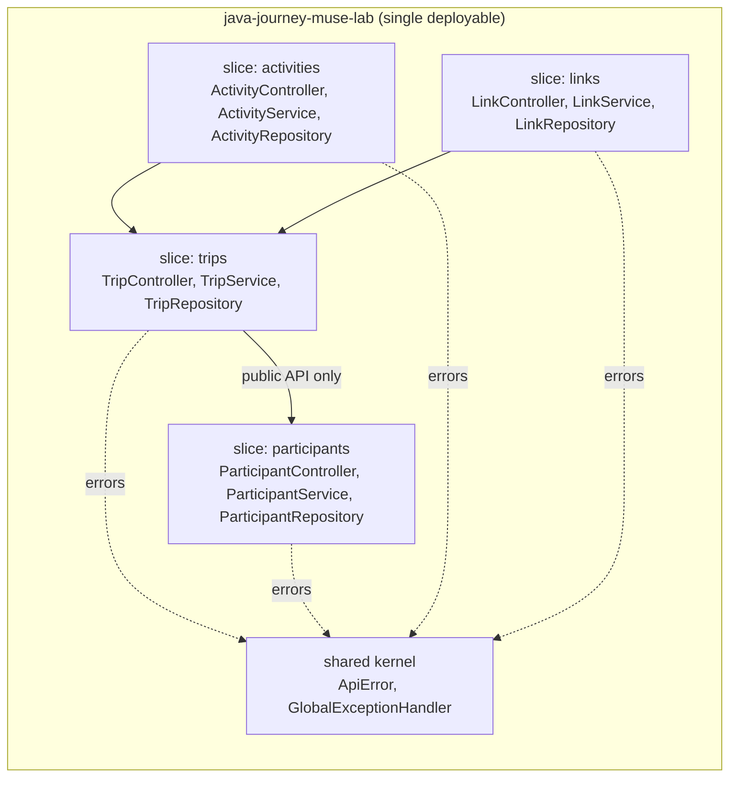
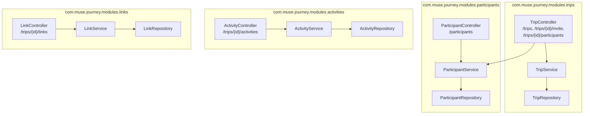

# ADR 0001 — Modular Monolith with Vertical Slices

- **Status:** Accepted
- **Date:** 2026-09-13
- **Project:** `java-journey-muse-lab` (ported from `java-journey-lemon-lab`)
- **Deciders:** Anderson Lima (Lemon) + Muse Code

## Context

`java-journey-lemon-lab` is a Spring Boot 3.3.1 / Java 21 trip-planner API
(trips, participants, activities, links) backed by H2 + Flyway. It works, but
its packaging follows the classic *layered* style with two structural smells:

1. **God controller** — `TripController` (~250 lines) owns 17 endpoints across
   4 domains (trips, participants, activities, links). Every feature change
   funnels through one file, one code-owner bottleneck, one merge-conflict
   magnet.
2. **Leaky module boundaries** — there are no boundaries: any class can touch
   any repository. `ParticipantService.registerParticipantsToEvent()` returned
   `repository.findAll()` (every participant in the database, not the trip's),
   and `TripCreateResponse` serialized raw JPA entities (recursion/leak risk).

The task: rebuild the app **from zero** preserving the REST contract, but
organized as a **modular monolith with vertical slices**, each slice owning
its controller → service → repository → DTOs → tests stack.

## Decision

One deployable (modular monolith), four business slices plus a shared kernel:



**Slice rules (enforced by review, documented here):**

| # | Rule |
|---|------|
| 1 | A slice owns its tables, entities, repositories, services, controllers, DTOs and tests. |
| 2 | Cross-slice access goes through the other slice's **service public API** only (e.g. trips invites via `ParticipantService`, never via `ParticipantRepository`). |
| 3 | No slice imports another slice's entity or repository class for writes; trip-scoped reads resolve the `Trip` first, then delegate. |
| 4 | Shared kernel holds only cross-cutting types (`ApiError`, `GlobalExceptionHandler`) — no business logic. |
| 5 | REST contract is frozen: same paths, verbs and status codes as the original (verified by the Postman collection + `scripts/validate-api.sh`). |

Request flow for the most coupled use case (create trip with invites):

```mermaid
sequenceDiagram
    autonumber
    participant C as Client
    participant TC as trips::TripController
    participant TS as trips::TripService
    participant PS as participants::ParticipantService
    participant DB as H2 (Flyway V1–V4)
    C->>TC: POST /trips {destination, dates, emails_to_invite}
    TC->>TS: createTrip(payload)
    TS->>DB: INSERT trips
    TC->>PS: registerParticipantsToEvent(emails, trip)
    PS->>DB: INSERT participants (batch)
    PS-->>TC: List&lt;Participant&gt; (saved rows only)
    TC-->>C: 200 {uuid, participants[]}
```

Package map (each box = one vertical slice, controller on top, DB at bottom):



## Bug fixes applied during the port

| # | Location (original) | Bug | Fix | Guard |
|---|---|---|---|---|
| 1 | `TripController.update` | called `setEndsAt` twice; `startsAt` never updated | `TripService.updateTrip` sets `startsAt` + `endsAt` correctly | `TripSliceRegressionTest.update_shouldChangeStartsAt_notJustEndsAt` + Postman "Update Trip" asserts `startsAt` |
| 2 | `ParticipantService.registerParticipantsToEvent` | returned `findAll()` — every participant in the DB, cross-trip leak | returns `saveAll(...)` result (only the invited rows) | `TripSliceRegressionTest.create_shouldReturnOnlyInvitedParticipants` + Postman asserts `participants.length == 1` on create |
| 3 | `TripCreateResponse` | exposed raw `Participant` JPA entities | returns `ParticipantData` DTOs (same JSON shape: `{uuid, participants[]}`) | Postman "Create Trip" + MockMvc tests read `uuid` |
| 4 | links slice | zero tests for the links CRUD added late in the original | new `LinkControllerTest` (9 tests) + Postman "links" folder | `mvn test` |

## Alternatives considered

- **Keep layered packaging, just split the god controller.** Rejected: splitting
  files without ownership rules re-creates the same coupling within weeks.
- **Microservices per domain (trips/participants/activities/links).** Rejected:
  4 tables, H2-embedded, zero independent scaling needs — distributed
  transactions and 4 pipelines for a demo planner is cost without benefit.
  The slice boundaries chosen here are exactly the seams a future extraction
  would follow, so the option stays open.
- **Add `spring-boot-starter-validation` + Bean Validation.** Rejected for now:
  the original validates manually (`ActivityService.validatePayload`) and the
  contract tests assert the current 400 shapes; introducing BV would change
  error payloads. Revisit if the API grows.

## Consequences

- ✅ Same REST contract (Postman collection from the original domain passes).
- ✅ Each slice can be understood, tested and reviewed in isolation
  (`mvn test -Dtest='...links.*'` etc.).
- ✅ Extraction path preserved: a slice + its tables can move out behind its
  service interface.
- ⚠️ Slice rules are conventional, not compiler-enforced (no ArchUnit yet) —
  accepted for a codebase this size; revisit if >6 slices.
- ⚠️ Tests pin the subclass Mockito mock maker
  (`src/test/resources/mockito-extensions/...MockMaker`) because ByteBuddy
  self-attach is blocked in sandboxed runtimes; zero production impact
  (no mocks are used — pure MockMvc tests).
