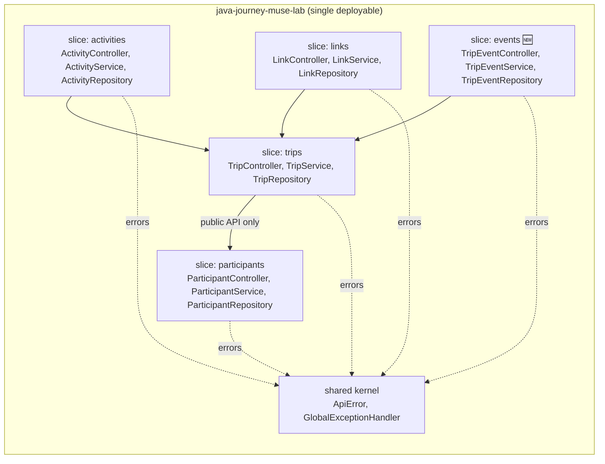
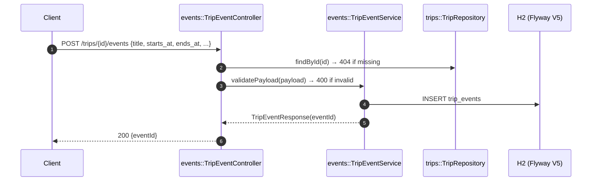
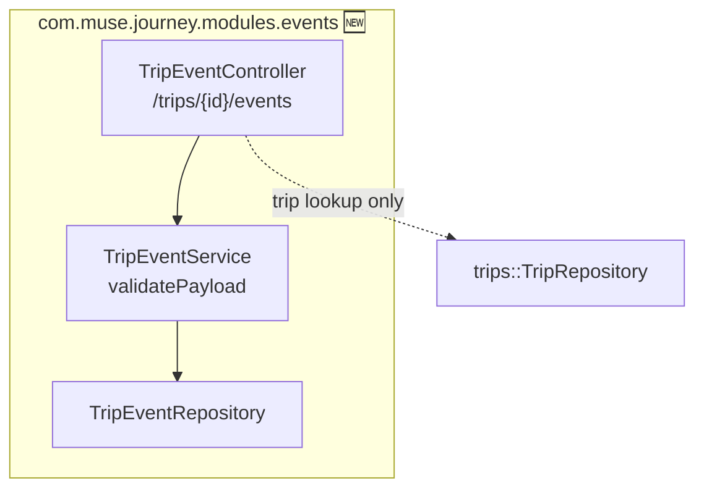
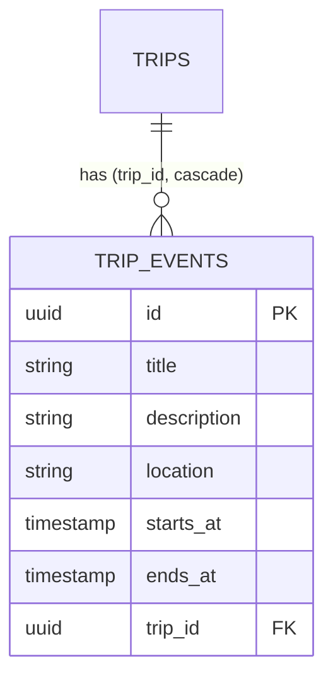

# ADR 0002 — TripEvents Slice (events)

- **Status:** Accepted
- **Date:** 2026-09-13
- **Project:** `java-journey-muse-lab`
- **Deciders:** Anderson Lima (Lemon) + Muse Code
- **Supersedes:** nothing — extends [ADR 0001](0001-modular-monolith-vertical-slices.md)

## Context

The trip planner needs a first-class **event schedule per trip** (kickoffs,
meetings, group outings): a dated, located entry with a start and an end,
scoped to one trip. `activities` only carries a single `occurs_at` timestamp
and no location/description, so overloading it would blur the aggregate.
A new vertical slice keeps the ownership rules from ADR 0001 intact.

## Decision

New slice `events` (`com.muse.journey.modules.events`), owning the
`TripEvent` aggregate end to end:

| Concern | Choice |
|---|---|
| Entity | `TripEvent`: `title` (required), `description` + `location` (optional), `starts_at` / `ends_at` (required, ISO date-time, `ends_at >= starts_at`), `trip_id` FK with `ON DELETE CASCADE` |
| Table | `trip_events`, Flyway `V5__create-table-trip-events.sql` |
| Endpoints | `POST / GET /trips/{id}/events`, `GET / PUT / DELETE /trips/{id}/events/{eventId}` |
| Validation | manual, in `TripEventService.validatePayload` (same style as `ActivityService`): blank title → 400, missing/malformed dates → 400, `ends_at` before `starts_at` → 400 |
| Trip scoping | every handler loads the `Trip` first (404 if missing), then delegates to the service; single-item reads/writes use `findByIdAndTrip` so an event from another trip is 404, never leaked |
| Naming | package `events`, entity/table `TripEvent` / `trip_events` — short URLs (`/events`), unambiguous schema name, no clash with `java.util.Event` or Spring's `ApplicationEvent` |

Register-event flow (same trip-scoped shape as activities/links):

Package map addition (the four existing slices are unchanged):

Data-model addition:

## Alternatives considered

- **Reuse `activities` with nullable extras.** Rejected: different invariant
  (`ends_at >= starts_at`), different read model, and every activities
  consumer would inherit event semantics.
- **Top-level `/events` with `trip_id` in the body (participants style).**
  Rejected: activities/links already proved the trip-scoped URL shape for
  aggregates that never exist without a trip; consistency wins.
- **Bean Validation (`@Valid`) instead of manual `validatePayload`.**
  Rejected for the same reason as in ADR 0001: keeps the 400 shapes and the
  no-new-dependency posture of the codebase.

## Consequences

- ✅ Fifth slice follows all five ADR-0001 slice rules (owns tables → tests;
  cross-slice reads go through `trips` only to resolve the parent).
- ✅ Contract growth only: no existing path, verb or status changed
  (Postman 23 → 29 requests, `validate-api.sh` extended, old requests untouched).
- ✅ Coverage: `TripEventControllerTest` (20 tests: create/list/get/update/
  delete + 400s + cross-trip 404s), `mvn test` 45 → 65 green.
- ⚠️ Known pre-existing inconsistency left alone: `LinkController.getAllLinks`
  does not 404 on an unknown trip while the activities/events list handlers
  do — harmonizing it would change the links contract, so it stays as is.
