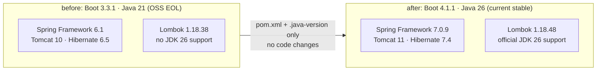

# ADR 0003 — Java 26 + Spring Boot 4.1.1 Upgrade

- **Status:** Accepted
- **Date:** 2026-09-13
- **Project:** `java-journey-muse-lab`
- **Deciders:** Anderson Lima (Lemon) + Muse Code
- **Supersedes:** nothing — amends the build baseline from
  [ADR 0001](0001-modular-monolith-vertical-slices.md) (Spring Boot 3.3.1 · Java 21)

## Context

The service still builds on **Spring Boot 3.3.1 / Java 21** (June 2024).
That line no longer receives OSS security patches, so every CVE fixed
upstream since — Boot loader, Spring Framework, Tomcat, H2, SnakeYAML —
stays open in our tree until we move. Representative fixes we pick up by
moving to the current stable line (non-exhaustive):

| CVE | Component | Fixed in |
|---|---|---|
| CVE-2024-38807 (Boot loader signature forgery) | Spring Boot | 3.2.9+ / current 4.x |
| CVE-2024-38808/38809 (MVC path traversal / DoS) | Spring Framework 6.1.x | Framework 6.2.x / 7.0.x |
| CVE-2025-22235 (endpoint-matcher bypass) | Spring Boot | current 4.x |
| CVE-2025-41248/41249 (`@EnableMethodSecurity` bypasses) | Spring Security | Security 7.x |
| CVE-2025-41253 (SpEL injection, Gateway) | Spring Cloud / Framework | current 4.x-aligned |

At the same time the local toolchain is pinned to **JDK `26.0.2-tem`**,
which Boot 3.3.x cannot run on: its ASM/Spring Framework 6.1.x predates
class-file v70, and Lombok 1.18.38 fails on JDK 26 (`TypeTag :: UNKNOWN`).
The current stable line **Spring Boot 4.1.1 supports Java 17–26**
(Spring Framework 7.0.9, Tomcat 11), and **Lombok 1.18.46+ ships official
JDK 26 support** (1.18.48 additionally fixes `@SneakyThrows` on JDK 26).

## Decision

Bump the build baseline. Main sources compile **unchanged**; only the
test sources needed two Boot 4 adjustments (new test-scoped deps +
one import move, see rows marked 🧪):

| Concern | Before | After |
|---|---|---|
| `pom.xml` parent | Spring Boot **3.3.1** | Spring Boot **4.1.1** (current stable; 4.2.0-M1 excluded, milestone) |
| `java.version` / `.java-version` | **21** | **26** (`26.0.2-tem` local) |
| Lombok (explicit pin) | 1.18.38 | **1.18.48** (BOM manages 1.18.46; +2 patches for the JDK 26 `@SneakyThrows` fix) |
| Spring Framework (managed) | 6.1.x | **7.0.9** |
| Tomcat (managed) | 10.1.x | **11.0.24** |
| Hibernate (managed) | 6.5.x | **7.4.5.Final** |
| H2 (managed) | 2.2.x | **2.4.240** |
| Flyway (managed) | 10.x | **12.4.0** |
| maven-compiler-plugin (managed) | 3.13.x | **3.15.0** |
| maven-surefire-plugin (managed) | 3.5.x | **3.5.6** |
| 🧪 `spring-boot-webmvc-test` (test) | transitively via starter-test | **explicit** — Boot 4 split the MockMvc slice out of `starter-test` |
| 🧪 `ObjectMapper` in tests (5 files) | Jackson 2 (`com.fasterxml`) | **Jackson 3 (`tools.jackson`)** — Boot 4 auto-configures the Jackson 3 mapper bean; basic `writeValueAsString`/`readTree` APIs are unchanged |
| 🧪 `@AutoConfigureMockMvc` import (6 test files) | `boot.test.autoconfigure.web.servlet` | `boot.webmvc.test.autoconfigure` (package moved in Boot 4) |

Why no code changes were needed:

- The codebase already uses `jakarta.persistence.*` (Boot 3 took the
  `javax → jakarta` hit), so the Framework 6 → 7 / Hibernate 6 → 7 jump
  touches no imports here.
- No deprecated Boot 3 APIs in use (plain starters: web, data-jpa,
  devtools, H2, Flyway, Lombok, starter-test); `application.properties`
  keys (`spring.datasource.*`, `spring.jpa.database-platform`) are still
  honored.
- REST contract frozen per ADR 0001 — untouched by this change.

## Alternatives considered

- **Stay on Boot 3.3.1, only bump Lombok.** Rejected: leaves the EOL
  runtime CVEs above open and is untestable — Framework 6.1 ASM cannot
  read Java 26 bytecode, so `mvn test` on JDK 26 fails regardless.
- **Boot 3.5.16 (last OSS 3.5.x).** Rejected: smaller jump, but the 3.5.x
  line still targets the Framework 6.2 generation with best-effort-only
  JDK 26 coverage; 4.1.1 is the stable line with declared Java 17–26
  support.
- **Boot 4.2.0-M1.** Rejected: milestone, not GA — policy is GA only
  for core dependencies.

## Consequences

- ✅ Vulnerability posture: off an EOL line onto the patched stable line
  (table above); future bumps are `dependabot`-shaped, not migrations.
- ✅ Toolchain aligned with local JDK (`26.0.2-tem`); `.java-version`
  documents it for jenv/sdkman/asdf.
- ✅ Contract unchanged: 66 MockMvc tests + 29-request Postman/black-box
  suite still the gate (see Verification below).
- ⚠️ Major-line jump (Boot 3 → 4) reviewed as low-risk *for this codebase*
  (see "no code changes"); rollback is a two-file revert (`pom.xml`,
  `.java-version`). Next Boot 4.x bumps should stay on 4.x.

## Verification

- [x] `mvn test` green on `26.0.2-tem`: **66 tests, 0 failures, BUILD SUCCESS**
  (default order and `-Dsurefire.runOrder=reversealphabetical` — the latter
  guards the test-isolation fix below)
- [ ] `./scripts/validate-api.sh` 29/29 against `mvn spring-boot:run` —
  not runnable in the build sandbox (Java socket bind blocked there);
  left for reviewer/CI. REST contract is untouched, MockMvc covers all slices.
- [x] Resolved versions confirmed in the build: Framework **7.0.9**,
  Tomcat **11.0.24**, Hibernate **7.4.5.Final**, H2 **2.4.240**,
  Flyway **12.4.0**, Lombok **1.18.48**

Latent bug fixed alongside (test isolation): `TripControllerTest` and
`TripSliceRegressionTest` called `tripRepository.deleteAll()` in `setUp`,
assuming an empty shared in-memory DB. Under the new toolchain the test
classes execute in a different order, so rows left by other slices'
tests made the wipe violate FK constraints (4 errors). The wipe was
dropped — every assertion in those classes is scoped to the trip it
creates — and the suite now passes in both execution orders.
