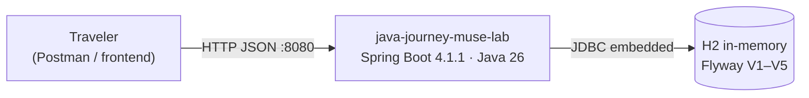
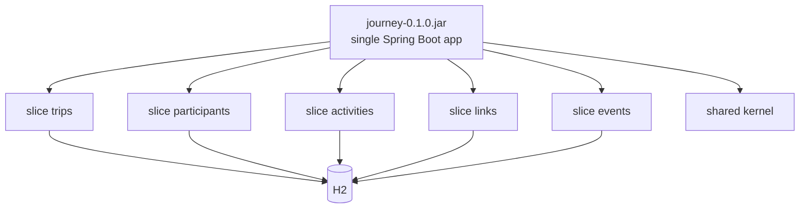
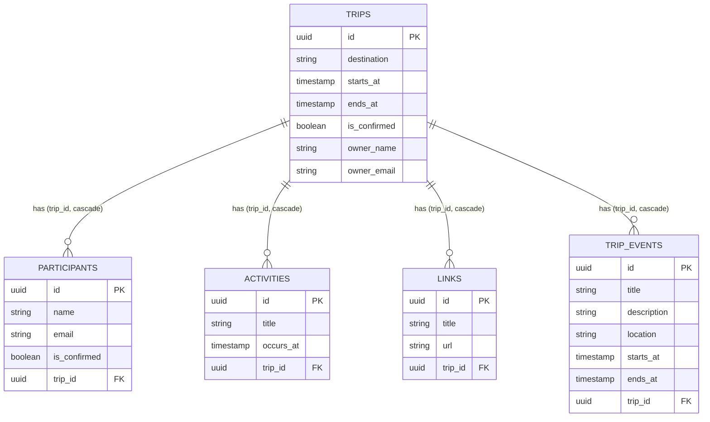

# Architecture — java-journey-muse-lab

Trip-planner API (`POST /trips` and friends) as a **modular monolith**:
one deployable, five vertical slices, one shared kernel.
Full rationale: [ADR 0001](adr/0001-modular-monolith-vertical-slices.md),
events slice: [ADR 0002](adr/0002-trip-events-slice.md),
Java 26 upgrade: [ADR 0003](adr/0003-java-26-spring-boot-4-upgrade.md).

## System context (C4 L1)

## Containers (C4 L2 — still one container, sliced inside)

## Slice ownership

| Slice | Package | Endpoints | Tables |
|---|---|---|---|
| trips | `modules.trips` | `POST/GET /trips`, `GET /trips/{id}`, `GET /trips/{id}/overview`, `PUT /trips/{id}`, `PATCH /trips/{id}/confirmation`, `POST /trips/{id}/invite`, `GET /trips/{id}/participants` | `trips` |
| participants | `modules.participants` | `GET/POST /participants`, `GET/PUT/DELETE /participants/{id}`, `POST /participants/{id}/confirm` | `participants` |
| activities | `modules.activities` | `POST/GET /trips/{id}/activities`, `GET/PUT/DELETE /trips/{id}/activities/{activityId}` | `activities` |
| links | `modules.links` | `POST/GET /trips/{id}/links`, `GET/PUT/DELETE /trips/{id}/links/{linkId}` | `links` |
| events | `modules.events` | `POST/GET /trips/{id}/events`, `GET/PUT/DELETE /trips/{id}/events/{eventId}` | `trip_events` |
| shared kernel | `shared` | `ApiError`, `GlobalExceptionHandler` (no business logic) | — |

Dependency rule: slices talk to each other **only via service public APIs**
(`TripController → ParticipantService`, never `→ ParticipantRepository`).
Trip-scoped slices load the `Trip` first (404 if missing), then delegate.

## Data model

Migrations: `src/main/resources/db/migration/V1..V5__*.sql` (Flyway).

## Verification map

| Layer | How | Where |
|---|---|---|
| Unit-of-slice (HTTP) | MockMvc, 66 tests, 7 classes | `src/test/java/...` |
| Contract (black-box) | Postman collection, 29 requests, ordered, asserts statuses + captures ids | `src/test/postman/` |
| Contract (CI-friendly) | Executable curl mirror of the collection | `scripts/validate-api.sh` |
| Bugfix guards | `TripSliceRegressionTest` (update-startsAt, invite isolation), `LinkControllerTest` | `src/test/java/...` |

Run everything: `mvn test`, then `./scripts/validate-api.sh` against
`mvn spring-boot:run` (or `npx newman run src/test/postman/*.json -e ...local...`).
