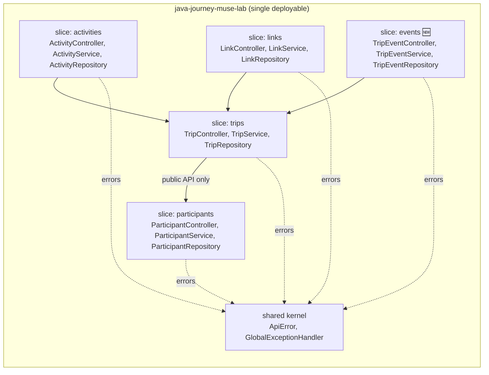
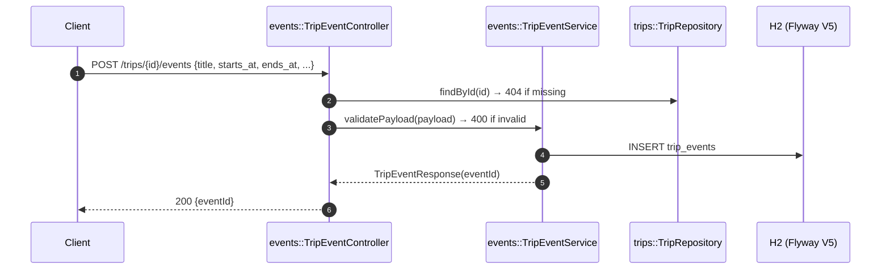
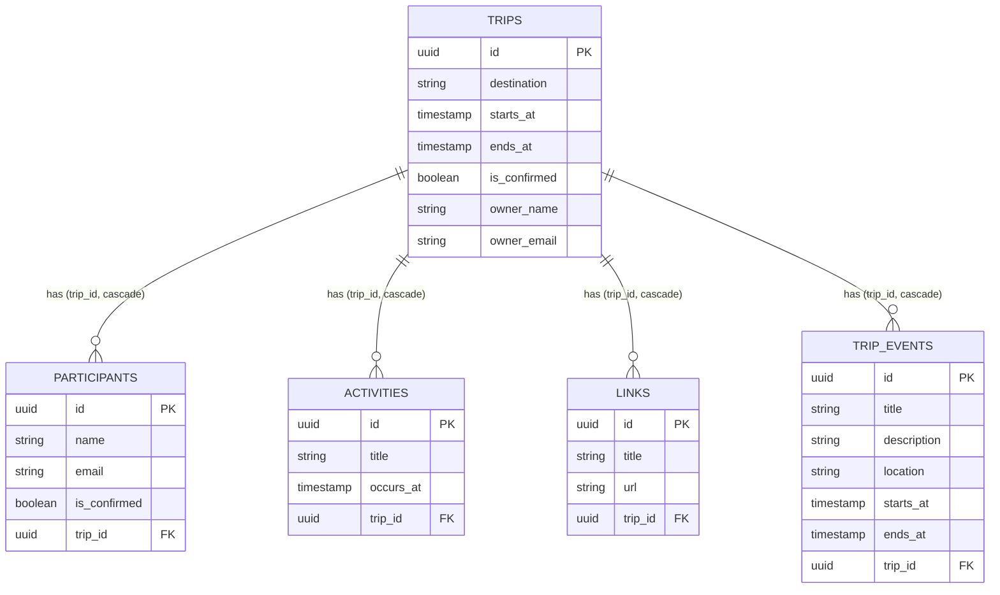

# feat: TripEvents slice (`/trips/{id}/events` CRUD)

New `events` vertical slice owning the `TripEvent` aggregate end to end,
following the ADR-0001 slice rules: `title` (required), `description` +
`location` (optional), `starts_at` / `ends_at` (required, `ends_at >=
starts_at`), trip-scoped CRUD with 404s for unknown trips and cross-trip
access. No existing path, verb or status changed — contract growth only.
Full rationale: `docs/adr/0002-trip-events-slice.md`.

## Module boundaries

Slice rule: cross-slice access only via the other slice's service public API.
The events slice touches `trips` only to resolve the parent trip (404 if
missing), exactly like the activities slice.

## Register-event flow

## Data model

## Endpoints (new)

| Method | Path |
|---|---|
| POST / GET | `/trips/{id}/events` |
| GET / PUT / DELETE | `/trips/{id}/events/{eventId}` |

Validation (manual `TripEventService.validatePayload`, same style as
activities): blank title → 400, missing/malformed dates → 400, `ends_at`
before `starts_at` → 400.

## Verification

- `mvn test` → **65/65 green** (7 classes: +20 `TripEventControllerTest`)
- `src/test/postman/java-journey-muse-lab.postman_collection.json` (29
  requests: +6 `events` folder, captures `eventId`) + `local.postman_environment.json`
- `./scripts/validate-api.sh [baseUrl]` — extended with the events slice
  (create/list/get/update/delete + gone-check) and an `ends_at < starts_at`
  400 negative case
- `npx newman run src/test/postman/java-journey-muse-lab.postman_collection.json -e src/test/postman/local.postman_environment.json`

Full context: `docs/architecture.md` (C4 L1/L2, ownership table, ER,
verification map), `docs/adr/0002-trip-events-slice.md` (alternatives,
naming, consequences).
