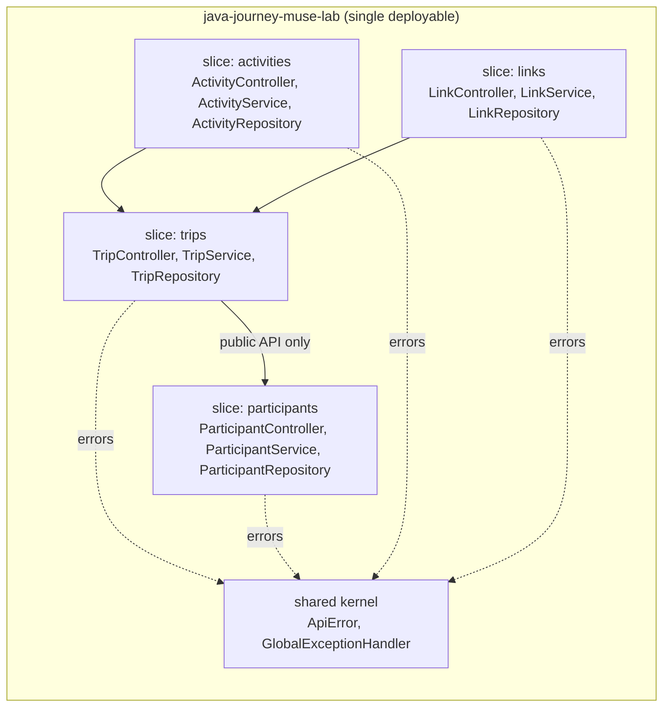
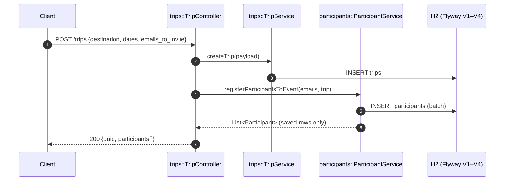
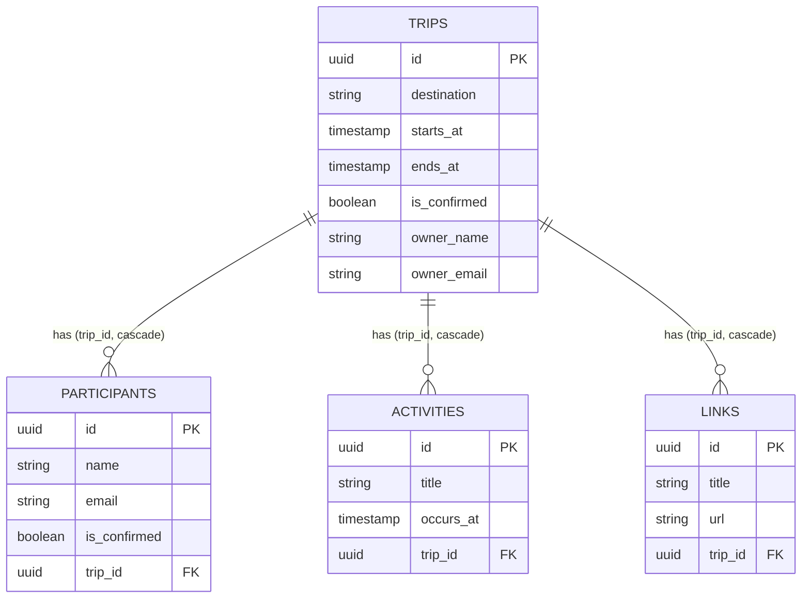

# docs: ADR-0001 modular monolith + architecture artifacts

Documents the refactor ported from `java-journey-lemon-lab` (see
`docs/adr/0001-modular-monolith-vertical-slices.md`): god `TripController`
split into 4 vertical slices + shared kernel, REST contract frozen, 4 bugs
fixed. Code is on `main`; this PR adds the decision record, the C4/ER
diagrams and the verification map. Rendered Mermaid below.

## Module boundaries

Slice rule: cross-slice access only via the other slice's service public API
(`TripController → ParticipantService`, never `→ ParticipantRepository`).

## Create-trip flow (most coupled use case)

## Data model

## Bug fixes (ported with guards)

| # | Original | Fix | Guard |
|---|---|---|---|
| 1 | `TripController.update` set `endsAt` twice, `startsAt` never | `TripService.updateTrip` sets both | `TripSliceRegressionTest` + Postman asserts `startsAt` |
| 2 | invite returned `findAll()` (cross-trip leak) | returns `saveAll()` rows only | regression test + Postman `participants.length == 1` |
| 3 | `TripCreateResponse` exposed JPA entities | `ParticipantData` DTOs, same JSON shape | MockMvc + Postman read `uuid` |
| 4 | links CRUD had zero tests | `LinkControllerTest` (9 tests) + Postman folder | `mvn test` |

## Verification

- `mvn test` → **45/45 green** (6 classes, MockMvc over the real HTTP layer)
- `src/test/postman/java-journey-muse-lab.postman_collection.json` (23 requests,
  ordered, captures ids) + `local.postman_environment.json`
- `./scripts/validate-api.sh [baseUrl]` — executable curl mirror of the collection
- `npx newman run src/test/postman/java-journey-muse-lab.postman_collection.json -e src/test/postman/local.postman_environment.json`

Full context: `docs/architecture.md` (C4 L1/L2, ownership table, verification map).
